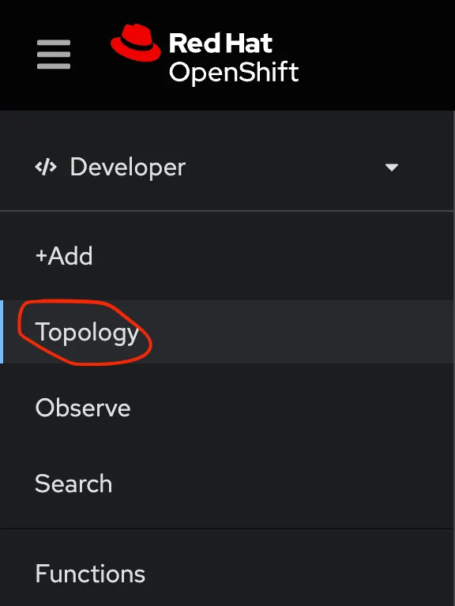
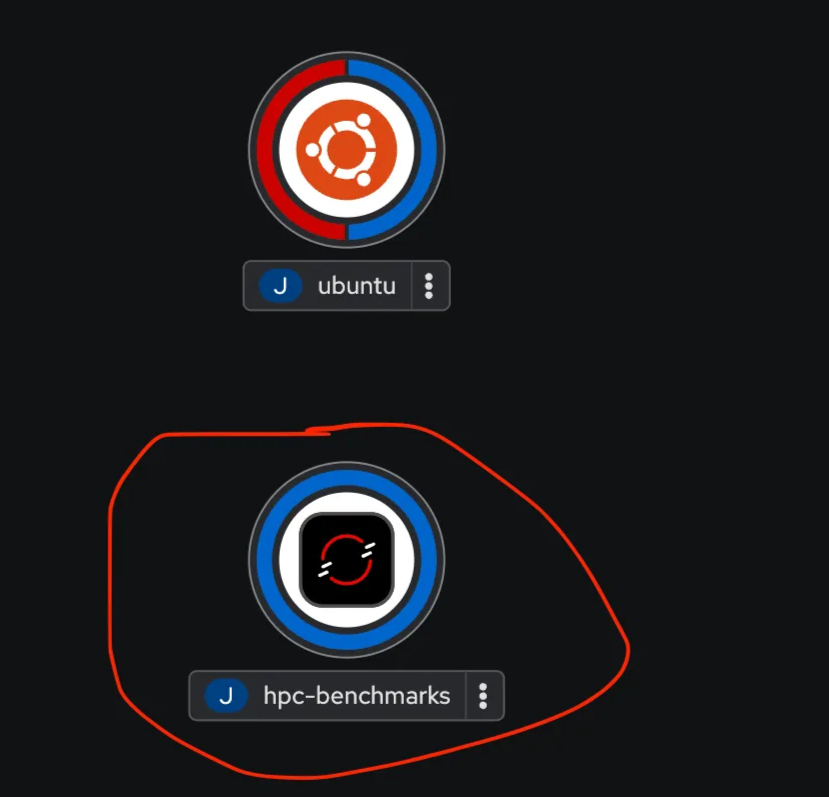
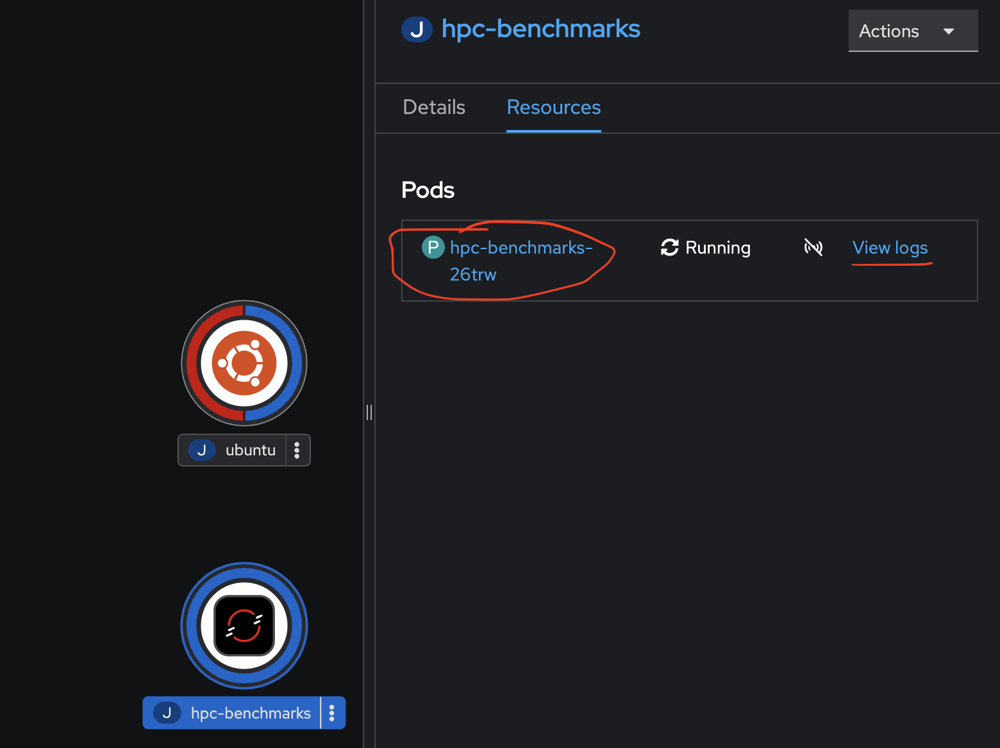
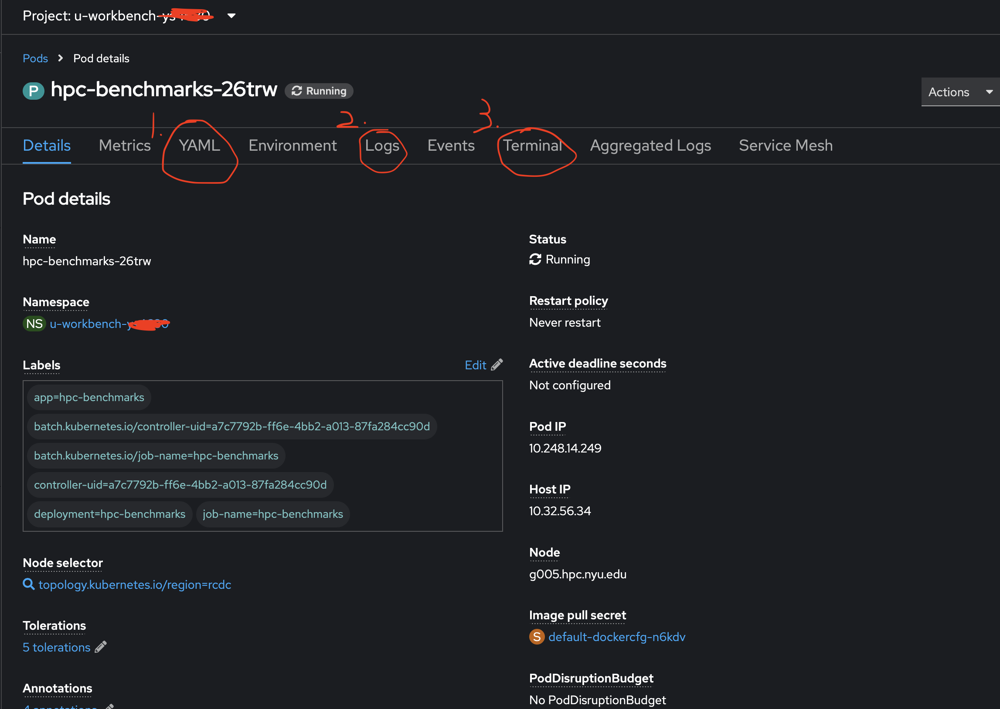

# Deploy an GPU application on Openshift

### Before Start:

1. Login to OpenShift from your local computer’s terminal:

```bash
OC login <your token>
```

1.  Switch to your project

```bash
OC project <Project's namespace>
```

1. Contact your administer to check your resource quota, such as how many GPUs, CPU cores, memory, PVC allowed to use.

### Step 1: Write a YAML

Please indicate your PVC,  Hardware Requirements(includes GPU, CPU, Memory), Container Image and Task (what commands shoule be run)

Here is a sample YAML to run HPL with 4 GPU on OpenShift:

```yaml
kind: Job
apiVersion: batch/v1
metadata:
  name: hpc-benchmarks
  namespace: u-workbench-ys4680
  labels:
    app: hpc-benchmarks
    app.kubernetes.io/component: hpc-benchmarks
    app.kubernetes.io/instance: hpc-benchmarks
    app.kubernetes.io/name: hpc-benchmarks
    app.openshift.io/runtime-namespace: u-workbench-ys4680
spec:
  parallelism: 1
  completions: 4
  template:
    metadata:
      labels:
        app: hpc-benchmarks
        deployment: hpc-benchmarks
    spec:
      volumes:
        - name: home
          persistentVolumeClaim:
            claimName: ys4680-data
        - name: tmp
          emptyDir:
            sizeLimit: 100Gi
        - name: cache-volume
          emptyDir:
            medium: Memory
            sizeLimit: 1000Mi
      containers:
        - resources:
            limits:
              cpu: "4"
              memory: 20Gi
              nvidia.com/gpu: "4"
            requests:
              cpu: "4"
              memory: 20Gi
              nvidia.com/gpu: "4"
          name: hpc-benchmarks
          volumeMounts:
            - name: home
              mountPath: /home
            - name: tmp
              mountPath: /scratch
            - name: cache-volume
              mountPath: /dev/shm
          image: >-
            nvcr.io/nvidia/hpc-benchmarks:25.02
          env:
            - name: TZ
              value: America/New_York
            - name: HOME
              value: /home/ys4680
          command:
            - /bin/bash
            - "-c"
            - |
              sleep infinity
              # mkdir -p /home/hpl # Change to your home directory
              # cp -r hpl-linux-x86_64/sample-dat/ /home/hpl/
              # cd /home/hpl/sample-dat
              # sed -i 's/190464[[:space:]]*Ns/95232       Ns/' HPL-4GPUs.dat
              # mpiexec -n 4 /workspace/hpl.sh --dat HPL-4GPUs.dat 2>&1 | tee stdout.log
              # sleep 600
      restartPolicy: Never
      tolerations:
        - effect: NoSchedule
          key: nvidia.com/usage
          operator: Equal
          value: dedicated
        - effect: NoSchedule
          key: nvidia.com/gpu
          operator: Exists
```

If you read the example, you will see that the command is `sleep infinity` rather than commands to actually run the HPL program. Using `sleep infinity` will help you to check the environment configuration or debug the first time you deploy a job.

### Step 2: Apply the job

After you log into OpenShift and create a YAML, you can deploy the job to the OpenShift cluster by:

```bash
# Assume the yaml you created is hpc-benchmarks.yaml
oc apply -f hpc-benchmarks.yaml
```

And you will see `job.batch/hpc-benchmarks created` if your deploy command success.

### Step 3: Check the job configuration

1. Login to your OpenShift console: https://console.cloud.rt.nyu.edu/ with NYU SSO
2. Click **Topology** button on the left barAnd 
    
    
    
    And you will see a page like below. This graph will include all your jobs on OpenShift include **hpc-benchmarks** we just created
    
    
    
3. To view more details about your job or check why it failed, click the job symbol and then click either the **pod name** or **logs**
    
    
    
    
    
    For example:
    
    1. You can check the actual YAML that Kubernetes used to launch your job by clicking **YAML**
    2. You can view the logs for your job to debug by clicking **Logs**
    3. You can interact with the machine running your job by clicking **Terminal**

### Step 4: Check the GPU status and workfolder

1. Start a interactive shell:
    
    **Option 1: Use openshift console**
    
    You can click the **Terminal** button in step 3. It will reload the page and direct you into a web based terminal.
    
    **Option 2: Use local command**
    
    1. Find running pod
        
        ```bash
        oc get pods
        ```
        
    2. **Connect to the pod's terminal**
        
        ```bash
        oc rsh <pod name>
        ```
        
    
    These ways will give you an interactive shell inside the container. Type `exit` if you want to leave the shell.
    
2. Check your GPU status by `nvidia-smi` . This command will show the number and status of your currently allocated GPUs.
3. Since your interactive shell is in the container, you can use commands such as `ls`, `which xxx`, etc. to confirm that the rest of your environment is configured correctly. For example, in this case, you should find that you are currently in ***/workspace***, and after using `ls` you will see a number of folders or files related to **HPL** and **HPCG**.

If everything looks well, which means  you can actually start the job.

### Step 5: Run HPL (or the applications you want)

1. Let’s delete the previous job first:
    
    ```bash
    oc delete job hpc-benchmarks
    ```
    
2. Modify your YAML to comment `sleep infinity` and **comment out actual commands**
    
    **If you using the example above**, please update the `mpiexec -n 4 /workspace/hpl.sh --dat HPL-4GPUs.dat` command based on your GPU request. Also, please don’t forget to verify the parameters in HPL-4GPUs.dat. For example, if you are using A100 80GB, you should comment out the command `sed -i 's/190464[[:space:]]*Ns/95232       Ns/' HPL-4GPUs.dat` since it cut the gird size by half.
    
3. Rerun the job: 
    
    ```bash
    oc apply -f hpc-benchmarks.yaml
    ```
    
4. View the result
    
    ```bash
    # Check GPUs status
    nvidia-smi
    # View HPL output
    cat /home/hpl/sample-dat/stdout.log
    ```
    

Great! Now you have successfully launch a job.