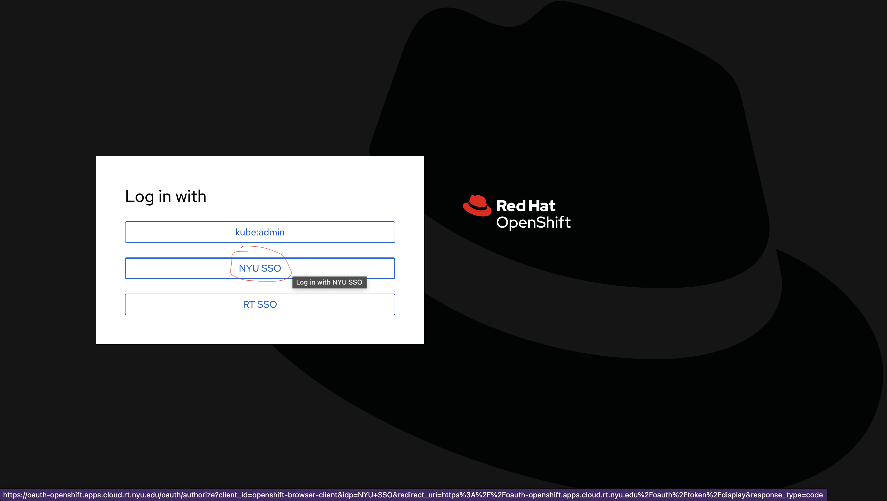
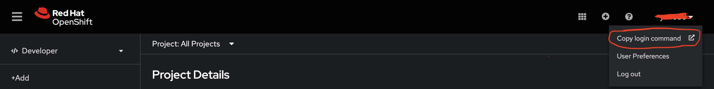
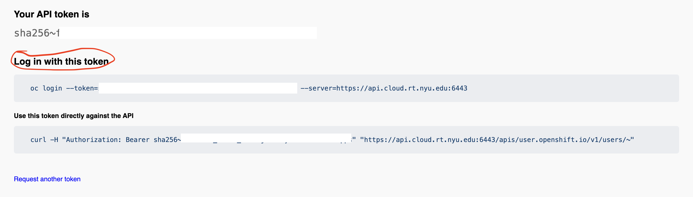

# OpenShift-Intro

## What is OpenShift and OC:

**OpenShift** is an enterprise-grade container application platform built on top of Kubernetes, provided by Red Hat. It helps developers and operations teams manage containerized applications and extends Kubernetes with additional enterprise-level features such as automated deployment, scaling, load balancing, monitoring, logging, and Continuous Integration/Continuous Delivery (CI/CD).

**OpenShift CLI (**oc**)** is the command-line tool provided by OpenShift to interact with OpenShift clusters. It is similar to Kubernetes’ kubectl but offers additional commands and functionality specifically for managing and operating OpenShift.

### Step 1: Install OC on your PC/laptop(macos)

```bash
brew install openshift-cli

# You can check if installation success by using which oc
# It should output a path
which oc
```

If you using Ubuntu:

```bash
VERSION="4.15.0"
wget https://mirror.openshift.com/pub/openshift-v4/x86_64/clients/ocp/${VERSION}/openshift-client-linux.tar.gz
tar -xvzf openshift-client-linux.tar.gz
sudo mv oc kubectl /usr/local/bin/
```

If you using Windows:

1. Navigate to the [OpenShift Container Platform downloads page](https://access.redhat.com/downloads/content/290) on the Red Hat Customer Portal.
2. Select the appropriate version in the **Version** drop-down menu.
3. Click **Download Now** next to the **OpenShift v4.8 Windows Client** entry and save the file.
4. Unzip the archive with a ZIP program.
5. Move the `oc` binary to a directory that is on your `PATH`. 
6. After you install the OpenShift CLI, it is available using the `oc` command:
    
    ```
    C:\> oc <command>
    ```
    

Find more about OC, such as how to install OC on a other OS:

Ref link: CLI: https://docs.openshift.com/container-platform/4.8/cli_reference/openshift_cli/getting-started-cli.html

### Step 2: Log in to Openshift: [https://console.cloud.rt.nyu.edu/](https://console.cloud.rt.nyu.edu/) with your NYU SSO (on campus or connected to NYU VPN)



### Step 3: Connect Open-shift with OC:

Firstly, logged into your Open-shift homepage;

Then click your username(NYU netID) at top-right corner, then click “Copy login command” button. It will open a new web site.



And Click the blue text (Display Token)


Copy the command under “Log in with this token” and paste to your terminal



If you got following output in your terminal, you will be fine.

```cpp
You have access to the following projects and can switch between them with 
'oc project <projectname>':
```

Here are some common commands for you to explore the OC:

```bash
# Switch to a project (namespace)
oc project <project-name>

# List available projects
oc projects

# Delete a resource
oc delete pod my-pod
## or
oc delete deployment my-deployment

# Get a list of all running pods in the current project
oc get pods

# Get all jobs
oc get jobs
```