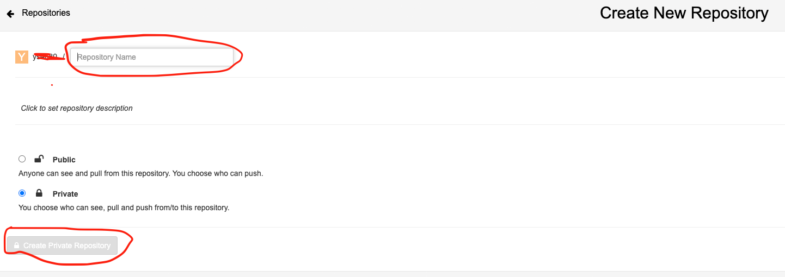

# Push a image to Quay use podman

## Before Start:

Please make sure you can login into Quay with NYU SSO

Quay: [https://registry.cloud.rt.nyu.edu/](https://registry.cloud.rt.nyu.edu/)

### **Step 1:** Sign In to Quay

Click the link of Quay above and choose “Sign in with NYU-SSO”. You may need to pass a NYU DuoMobile Authorization.


Once login successful, you will see:


### **Step 2:** Setup a Password

After logging in for the first time, you'll receive a message to set up your password. Follow the steps in the message to create and save your password—you'll need it later when creating tokens.

## Build a image using podman

We will use ***podman*** to pull and push from Dockerhub or Quay. Podman is a more secure and flexible alternative to Docker because it runs containers in rootless mode by default, reducing security risks. Unlike Docker, which relies on a background daemon, Podman operates in a daemonless architecture, meaning each container runs as a separate process, improving stability and reducing potential attack surfaces. Additionally, Podman is fully compatible with OCI standards, allowing seamless interaction with Kubernetes and existing Docker images while providing better system integration and user-level control.

### Step 1: Install podman on your local machine:

**If you using one of Linux distributions:**


For Debian/Ubuntu-based Systems

```bash
sudo apt update
sudo apt install -y podman
```

For RHEL/CentOS/Fedora

```bash
sudo dnf install -y podman
```

OR you want to use GUI version:

Choose AMD64 binary (tar.gz) from 

[https://podman-desktop.io/downloads](https://podman-desktop.io/downloads)

**If you using MacOS(support both Intel Chip and APPLE Silicon):**


Option 1: Install via *Homebrew*

```bash
brew install podman
```

Option 2: Download Podman Desktop from the official site:

[https://podman-desktop.io/downloads](https://podman-desktop.io/downloads)

Choose your macos and corresponding chip, then Install and start Podman Desktop.

**If you using Windows:**


Option 1: Install Podman Desktop (Recommended for GUI Users)

1. Download **Podman Desktop**:

 [https://podman.io/getting-started/installation](https://podman.io/getting-started/installation)

1. Install it and start Podman.

**Option 2: Install Podman via WSL2 (For CLI Users)**

Inside WSL, install Podman:

```bash
podman machine init
podman machine start
```

### Step 2: Verify

You will be able to verify Installation by:

```bash
podman --version
podman info
```

To know more about installation of podman, please refer to this link:

https://podman.io/docs/installation

### Step 3: Start Podman Machine (Only for macos CLI Users)

Since macOS doesn’t support native containers, start a virtualized Podman environment first:

```bash
podman machine init
podman machine start
```

To close the VM and remove it (When you finish your work):

```bash
podman machine stop
podman machine rm
```

## Using podman pull a docker image

We will use Ubuntu as an example. You can find official docker for Ubuntu from Dockerhub: 

https://hub.docker.com/_/ubuntu

### Step 1: Pull the docker

```bash
podman pull ubuntu
```

### Step 2: Test and run:

To test if the pull docker image was successful, we can run the image locally.

```bash
podman run -it ubuntu /bin/bash
```

After this command, you will enter is docker environment which is an Ubuntu OS. You can check your OS version by:

```bash
cat /etc/os-release

### Sample Output:
PRETTY_NAME="Ubuntu 24.04.1 LTS"
NAME="Ubuntu"
VERSION_ID="24.04"
VERSION="24.04.1 LTS (Noble Numbat)"
VERSION_CODENAME=noble
ID=ubuntu
ID_LIKE=debian
HOME_URL="https://www.ubuntu.com/"
SUPPORT_URL="https://help.ubuntu.com/"
BUG_REPORT_URL="https://bugs.launchpad.net/ubuntu/"
PRIVACY_POLICY_URL="https://www.ubuntu.com/legal/terms-and-policies/privacy-policy"
UBUNTU_CODENAME=noble
LOGO=ubuntu-logo
```

### Other Useful commands:

Lists **all** containers, including both **running and stopped** containers:

```bash
podman ps -a
# Without -a, podman ps only shows running containers.
```

Lists all **available container images** stored locally:

```bash
podman images
```

To find more useful commands:

https://docs.podman.io/en/stable/Commands.html

## Push the image to Quay

Now we're going to build a Ubuntu image and push it into Quay. The Quay registry at [https://registry.cloud.rt.nyu.edu/](https://registry.cloud.rt.nyu.edu/) is a private container image registry hosted by NYU, likely used for managing and distributing container images for research, development, and deployment within the university’s cloud environment. Quay is an alternative to Docker Hub, offering secure storage, vulnerability scanning, and access control for container images. Users can push, pull, and manage images using Podman or Docker while benefiting from authentication and role-based access control provided by NYU’s cloud infrastructure.

### Step 1: Create Docker CLI and other Application Tokens

1. After login, click setting icon in the left navbar
    
    
    
2. Click **Create Application Token** under Docker CLI and other Application Tokens
    
    
    
3. Enter a title.
    
    
    
4. After creating a token, click its title. You will need to enter the password you created earlier.
5. Click **Podman Login** and copy the ***command***:
    
    
    

### Now you can login to the Quay through CLI from your local machine

Paste the command you just copy to  your terminal and execute it.

### Step 2: Create a repository for the image on Quay

1. Click **Create New Repository** on top right corner:
    
    
    
2. Fill the name you want for your repo and click **Create Public/Private Repository**. You can choose ethier Public or Private based on your demand.
    
    
    
3. Once succesful created, you will be redirect to following page. Feel free to change your previous setting by clicking on the icon in the red circle on the left:
    
    
    

### Step 3: Build a Ubuntu image using podman

1. Create a **Dockerfile**
    
    ```bash
    touch **Dockerfile**
    ```
    
    Add following d**eclarations** into the Dockerfile
    
    ```bash
    FROM ubuntu:22.04
    
    ENV TZ "America/New_York"
    ARG DEBIAN_FRONTEND=noninteractive
    
    RUN apt-get update && \
        apt-get install -y tzdata build-essential gfortran automake make wget git file \
        python3 rsync openssh-client net-tools bc expect \
        cmake cmake-curses-gui \
        libblas-dev liblapack-dev libpcre3-dev libarpack2-dev libcurl4-gnutls-dev epstool libfftw3-dev libhdf5-dev libboost-all-dev
    ```
    
    This **Dockerfile** sets up an Ubuntu 22.04-based container with essential development tools and libraries. It defines an **environment variable (ENV TZ)** for the timezone and a **build argument (ARG DEBIAN_FRONTEND)** to make apt-get installations non-interactive. The **RUN instruction** updates package lists and installs various dependencies, including compilers (gfortran, make), libraries (libblas-dev, libhdf5-dev, libboost-all-dev), and utilities (wget, git, rsync). These configurations ensure a well-equipped environment for building and running scientific or development applications.
    
2. Build the image
    
    ```bash
    podman build -t ubuntu:24.04 .
    ```
    
    If you using Macbook with Apple Silicon chip
    
3. You can test your image by runing it
    
    ```bash
    podman run -it localhost/ubuntu:24.04 /bin/bash
    ```
    

### Step 4: Push the Ubuntu image to Quay

1.  Navigating to the repo you just created and copy the website link
    
    
    
    In this example, the path will be [registry.cloud.rt.nyu.edu/<your-NYU-NetID>/ubuntu-test](https://registry.cloud.rt.nyu.edu/repository/ys4680/ubuntu-test)
    
2. Tag the image to the path
    
    ```bash
    podman tag ubuntu:24.04 registry.cloud.rt.nyu.edu/<your-NYU-NetID>/ubuntu-test
    ```
    
3. Push the image to Quay
    
    ```bash
    podman push registry.cloud.rt.nyu.edu/<your-NYU-NetID>/ubuntu-test
    ```
    

Now you can go to Quay and check your image by click Tags in the left bar:


### **Feel free to pull your docker from Quay and run it !**